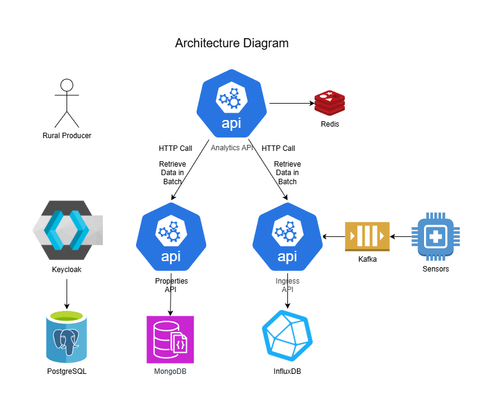

# Projeto Hackathon para Monitoramento de Propriedades Rurais

## Visão Geral

O sistema é composto por uma arquitetura baseada em microsserviços, orientada a eventos e preparada para ingestão e análise de dados de sensores em propriedades rurais. O diagrama abaixo representa os principais componentes e seus fluxos de comunicação.

A proposta é permitir que dados coletados em campo (sensores) sejam ingeridos, armazenados, processados e posteriormente consumidos por produtores rurais através de uma API centralizada.



## Componentes

### 👤 Rural Producer

Representa o usuário final (produtor rural), que consome os dados e insights por meio da **Analytics API**.

---

### 🔷 Analytics API

Serviço responsável por consolidar e disponibilizar dados analíticos ao usuário final.

Funções principais:

* Receber requisições HTTP do produtor rural
* Consultar dados em batch em outros serviços
* Utilizar o **Redis** como cache para melhorar performance
* Orquestrar chamadas para:

  * **Properties API** (dados cadastrais)
  * **Ingress API** (dados de sensores)

---

### 🟥 Redis

Utilizado como camada de cache para a **Analytics API**, reduzindo latência e evitando consultas repetidas aos serviços dependentes.

---

### 🔷 Properties API

Responsável pelo gerenciamento de dados relacionados às propriedades rurais.

Funções principais:

* Cadastro e consulta de propriedades
* Persistência dos dados no **MongoDB**

---

### 🟪 MongoDB

Banco de dados NoSQL utilizado para armazenar os dados estruturais e cadastrais das propriedades.

---

### 🔷 Ingress API

Serviço responsável pela ingestão e processamento dos dados vindos dos sensores.

Funções principais:

* Consumir eventos provenientes do **Kafka**
* Processar dados de telemetria
* Persistir séries temporais no **InfluxDB**
* Disponibilizar dados para consumo da **Analytics API**

---

### 🟧 Kafka

Plataforma de mensageria utilizada como broker de eventos entre os sensores e a **Ingress API**.

Benefícios:

* Comunicação assíncrona
* Maior resiliência
* Escalabilidade no processamento de eventos

---

### 📟 Sensors

Representam dispositivos de campo responsáveis pela coleta de dados (ex: temperatura, umidade, localização, etc.).

Esses dados são enviados para o Kafka, simulando um cenário real de IoT.

---

### 🛡️ Keycloak

Responsável pela autenticação e autorização dos usuários e serviços.

Funções principais:

* Gerenciamento de identidade (IAM)
* Emissão e validação de tokens (OAuth2 / OpenID Connect)
* Integração com banco PostgreSQL

---

### 🐘 PostgreSQL

Banco de dados utilizado pelo **Keycloak** para persistência de usuários, credenciais e configurações de segurança.

---

## Fluxo Geral de Dados

1. Sensores enviam dados → **Kafka**
2. **Ingress API** consome os eventos e armazena no **InfluxDB**
3. **Properties API** gerencia dados cadastrais no **MongoDB**
4. **Analytics API** consulta os dois serviços em batch
5. Resultados são cacheados no **Redis**
6. O produtor rural consome os dados via requisições HTTP

## Infraestrutura como Código (IaC)


O projeto utiliza Docker Compose para orquestrar todos os serviços. O arquivo principal [`docker-compose.yml`](docker-compose.yml) está na raiz do projeto e inclui os arquivos de definição de cada serviço localizados na pasta [`iac`](iac/):

- [`iac/analytics-docker-compose.yml`](iac/analytics-docker-compose.yml)
- [`iac/ingress-docker-compose.yml`](iac/ingress-docker-compose.yml)
- [`iac/keycloak-docker-compose.yml`](iac/keycloak-docker-compose.yml)
- [`iac/properties-docker-compose.yml`](iac/properties-docker-compose.yml)
- [`iac/sensors-docker-compose.yml`](iac/sensors-docker-compose.yml)


### Como iniciar todos os serviços

No terminal, acesse a raiz do projeto (onde está o arquivo `docker-compose.yml`) e execute:

```sh
docker compose up -d
```

Isso irá iniciar todos os serviços definidos nos arquivos de compose incluídos.

### Como iniciar apenas serviços específicos

Você pode subir apenas um serviço (e suas dependências) usando:

```sh
docker compose up -d <nome-do-serviço>
```

Por exemplo, para subir apenas o serviço de sensores:

```sh
docker compose up -d sensors
```

> Certifique-se de que os arquivos de compose individuais estejam devidamente configurados com os serviços necessários.

### Como parar e remover os containers

Para parar todos os containers:

```sh
docker compose stop
```

Para parar e remover todos os containers, redes e volumes criados:

```sh
docker compose down
```

Você também pode usar essas opções com arquivos de compose personalizados usando a opção `-f`.
